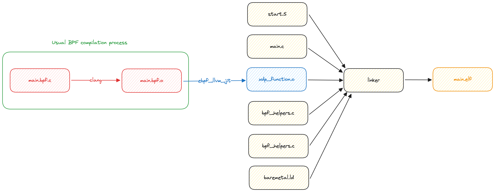

# Examples



This folder contains some examples of how the compiler can be used to create baremetal programs for QEMU-riscv64.

All examples are composed by two pieces:
1. Runtime
2. BPF program

## Runtime
The runtime is the code that will run on the VM instead of the OS, it will:
- Load the packet from memory.
- Expose a helper function (`bpf_printk()` decalred as `_bpf_helper_ext_0006`).
- Handle the result of the XDP program.

Most of the runtime code is shared between examples and can be found in the [99_baremetal_runtime](../rv64_baremetal_runtime/) folder.

## BPF code
The bpf code contains only XDP programs with no maps ATM.

## deps
```shell
git submodule update --init --recursive
```
